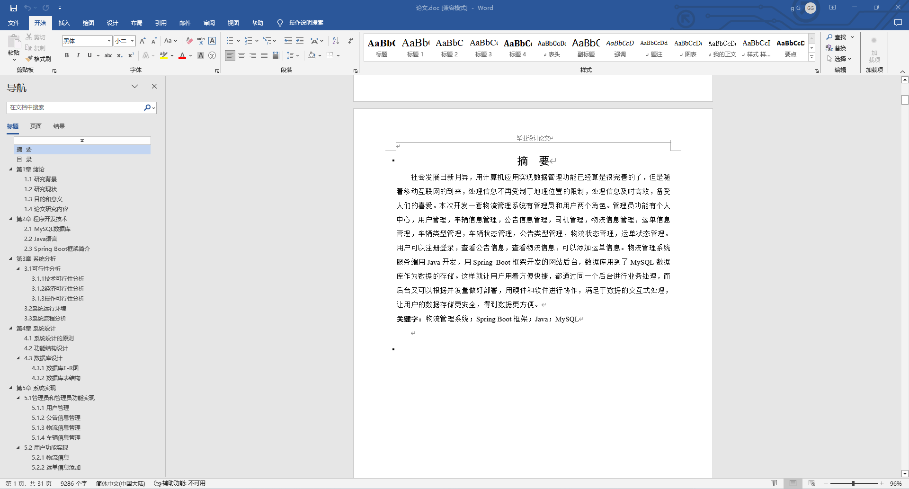
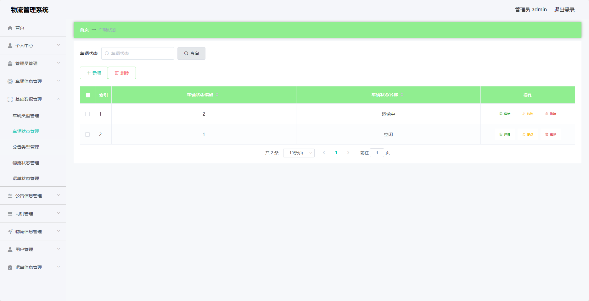
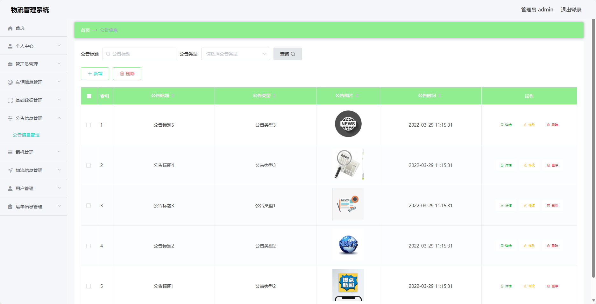
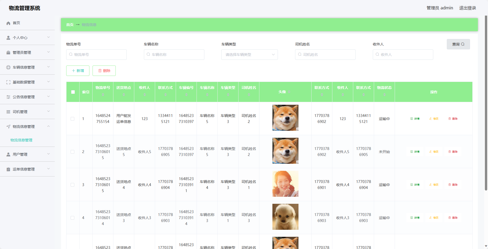
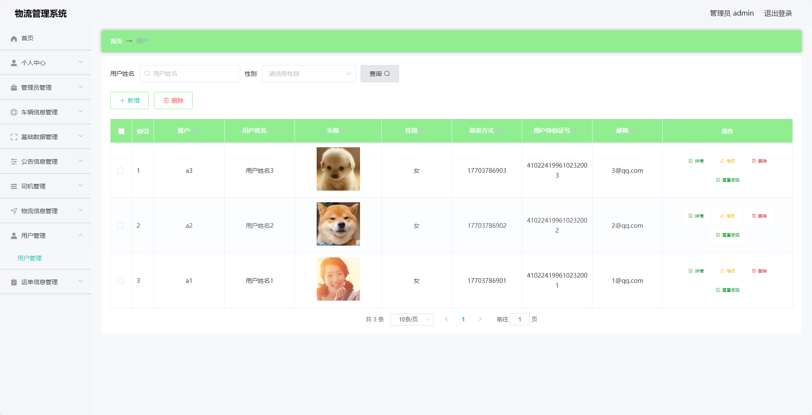
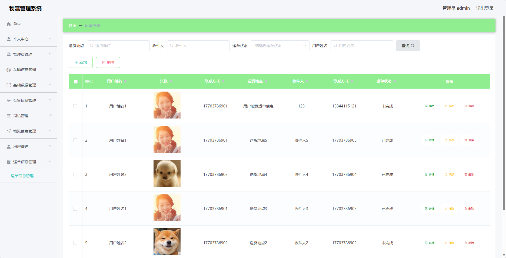
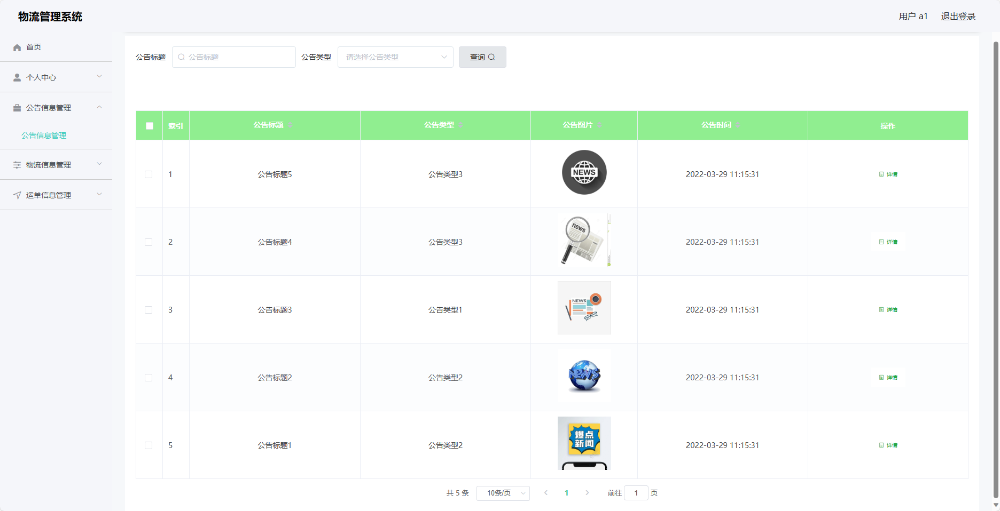
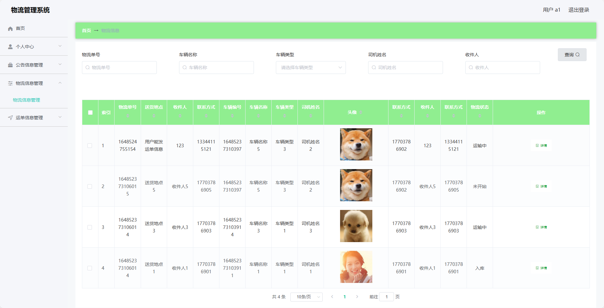

## 基于SpringBoot的物流管理系统(程序+报告)

###  获取sql数据库文件: 从戎源码网 (https://armycodes.com/) QQ: 386869957 QQ群: 377586148
###  所有系统地址: (https://github.com/YuLin-Coder/AllProjectCatalog) 
###  所有项目以及源代码本人均调试运行无问题 可支持远程安装部署调试、定制修改、代码讲解

## 项目介绍
基于SpringBoot的物流管理系统，系统包含两种角色：管理员、用户,系统分为前台和后台两大模块，主要功能如下。

### 【管理员】:
- 个人中心：管理个人信息，包括修改个人信息、查看订单记录等。
- 基础数据管理：管理系统的基础数据，包括车辆信息、司机信息、用户信息等。
- 公告管理：管理系统的公告信息，包括添加、编辑、删除公告等操作。
- 司机管理：管理系统的司机信息，包括添加、编辑、删除司机等操作。
- 车辆管理：管理系统的车辆信息，包括添加、编辑、删除车辆等操作。
- 物流信息管理：管理系统的物流信息，包括物流状态更新等操作。
- 用户管理：管理系统的用户信息，包括添加、编辑、删除用户等操作。
- 运单管理：管理系统的运单信息，包括下单、发货、签收等操作。

### 【用户】:
- 个人中心：管理个人信息，包括修改个人信息、查看订单记录等。
- 公告管理：管理系统的公告信息，包括添加、编辑、删除公告等操作。
- 物流信息管理：管理系统的物流信息，包括查看物流状态、预计到达时间等。
- 运单管理：管理系统的运单信息，包括下单、发货、签收等操作。

### 【前台】:
- 首页：展示系统的一些基本信息和轮播图。
- 发货单：用户可以填写发货单。
- 公告：展示系统的公告信息。
- 物流跟踪：用户可以根据运单号查询物流信息。
- 个人中心：管理个人信息，包括修改个人信息、查看订单记录等。

## 项目技术
- 编程语言：Java
- 数据库：MySQL
- 项目管理工具：Maven
- 前端技术：HTML、CSS、JavaScript、Jquery、Vue
- 后端技术：Spring、SpringMVC、MyBatis

## 运行环境
- JDK版本：JDK1.8及以上
- 开发工具：IDEA、Ecplise、Myecplise都可以
- 数据库: MySQL5.7及以上
- Maven：maven3.0及以上
- Node：14.14.0及以上

## 运行截图

